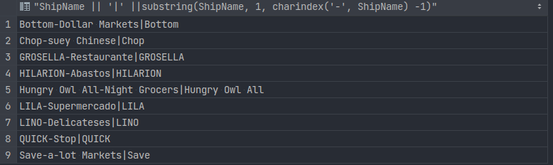
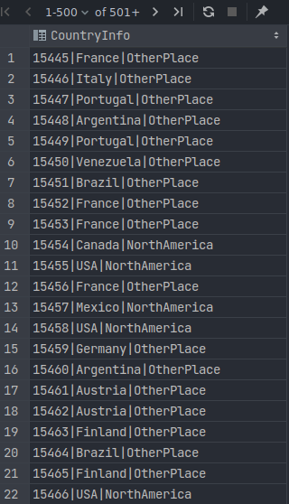
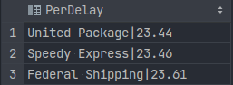
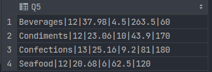
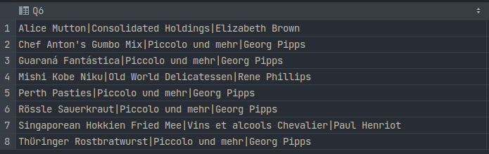
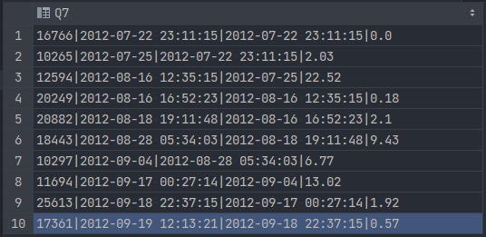
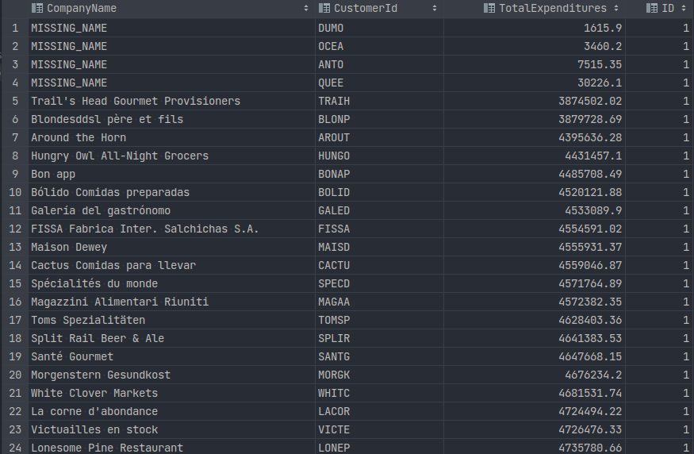
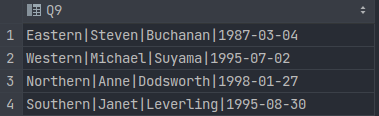
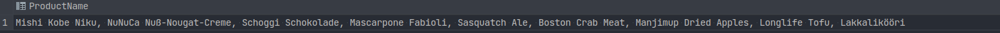

# scudb(p1)

**2019141460319 金可成**

## q1

### Problem Description

+ The purpose of this query is to make sure that the formatting of your output
  matches exactly the formatting of our auto-grading script.
+ **Details**: List all Category Names ordered alphabetically.


### Code

```sql
SELECT CategoryName
FROM Category
ORDER BY CategoryName;
```

### Result


## q2

### Problem Description
+ Get all unique `ShipNames` from the Order table that contain a hyphen `'-'` 
+ **Details**: In addition, get all the characters preceding the (first) hyphen. Return ship
names alphabetically. Your first row should look like `Bottom-Dollar Markets|Bottom`

### Code

```sql
SELECT DISTINCT ShipName || '|' || SUBSTR(ShipName, 1, INSTR(ShipName, '-') -1)
FROM "Order"
WHERE ShipName LIKE '%-%'
ORDER BY ShipName;
```

### Result




## q3

### Problem Description

+ Indicate if an order's `ShipCountry` is in North America. For our purposes, this
  is `'USA', 'Mexico', 'Canada'`
+ **Details**: You should print the Order `Id` , `ShipCountry` , and another column that is
  either `'NorthAmerica'` or `'OtherPlace'` depending on the Ship Country.
  Order by the primary key ( `Id` ) ascending and return 20 rows starting from Order
  `Id` `15445` Your output should look
  like `15445|France|OtherPlace` or `15454|Canada|NorthAmerica`

### Code

```sql
SELECT Id || '|' || ShipCountry || '|' ||
CASE
    WHEN ShipCountry IN ('USA', 'Mexico', 'Canada') THEN 'NorthAmerica'
    ELSE 'OtherPlace'
END AS CountryInfo
FROM "Order"
WHERE Id >=15445
ORDER BY Id;
```

### Result




## q4

### Problem Description

+ For each `Shipper` , find the percentage of orders which are late
+ **Details**: An order is considered late if ShippedDate > RequiredDate . Print the
  following format, order by descending percentage, rounded to the nearest
  hundredths, like United Package|23.44

### Code

```sql
SELECT Delay.CompanyName || '|' ||
       ROUND((CAST(Delay AS FLOAT) * 100 / CAST(Total AS FLOAT)) ,2) AS PerDelay
FROM
    (SELECT  S.Id, S.CompanyName, COUNT(*) AS Delay
    FROM Shipper S, "Order" O
    WHERE S.Id = O.ShipVia AND O.ShippedDate > O.RequiredDate
    GROUP BY S.Id) Delay
    ,
    (SELECT  S.Id, S.CompanyName, COUNT(*) AS Total
    FROM Shipper S, "Order" O
    WHERE S.Id = O.ShipVia
    GROUP BY S.Id) Total
WHERE Delay.Id = Total.Id
ORDER BY PerDelay DESC
```

### Result




## q5

### Problem Description

+ Compute some statistics about categories of products
+ **Details**: Get the number of products, average unit price (rounded to 2 decimal
  places), minimum unit price, maximum unit price, and total units on order for
  categories containing greater than 10 products.
  Order by Category `Id` . Your output should look like `Beverages|12|37.98|4.5|263.5|60`

### Code

```sql
SELECT CategoryName || '|' ||
       COUNT(*) || '|' ||
       round(AVG(UnitPrice), 2) || '|' ||
       MIN(UnitPrice) || '|' ||
       MAX(UnitPrice) || '|' ||
       SUM(UnitsOnOrder) AS Q5
FROM Product, Category
WHERE Product.CategoryId = Category.Id
GROUP BY CategoryId
HAVING COUNT(*) > 10
ORDER BY CategoryId
```

### Result




## q6

### Problem Description

+ For each of the 8 discontinued products in the database, which customer made the
  first ever order for the product? Output the
  customer's `CompanyName` and `ContactName`
+ **Details**: Print the following format, order by `ProductName` alphabetically: `Alice
  Mutton|Consolidated Holdings|Elizabeth Brown`

### Code

```sql

```

### Result




## q7

### Problem Description

+ For the first 10 orders by `CutomerId BLONP` : get the Order's `Id` , `OrderDate` ,
  previous `OrderDate` , and difference between the previous and current. Return
  results ordered by `OrderDate` (ascending)
+ **Details**: The "previous" `OrderDate` for the first order should default to itself (lag
  time = 0). Use the `julianday()` function for date arithmetic (example).
  Use lag(expr, offset, default) for grabbing previous dates.
  Please round the lag time to the nearest hundredth, formatted like `17361|2012-09-
  19 12:13:21|2012-09-18 22:37:15|0.57`


### Code

```sql
WITH final AS (
    WITH cte AS (
        WITH cte_BLONP AS (
            SELECT Id, OrderDate
            FROM "Order"
            WHERE "Order".CustomerId = 'BLONP'
            ORDER BY OrderDate
            LIMIT 10
        )
        SELECT *,
               lag(OrderDate) over ()           AS Temp,
               rank() over (ORDER BY OrderDate) AS Rank
        FROM cte_BLONP
    )

    SELECT Id, OrderDate,
           CASE
               WHEN Rank=1 THEN OrderDate
               ELSE Temp
               END AS PreOrderDate
    FROM cte
)

SELECT Id || '|' ||
       OrderDate || '|' ||
       PreOrderDate || '|' ||
       ROUND(CAST(julianday(OrderDate) - julianday(PreOrderDate) AS FLOAT), 2) AS Q7
FROM final
```

### Result




## q8

### Problem Description

+ For each `Customer` , get the CompanyName, CustomerId, and "total expenditures".
  Output the bottom quartile of Customers, as measured by total expenditures.
+ Details: Calculate expenditure using `UnitPrice` and `Quantity` (ignore `Discount` ).
  Compute the quartiles for each company's total expenditures using <ins>NTILE</ins>. The
  bottom quartile is the 1st quartile, order them by increasing expenditure.
  Make sure your output is formatted as follows (round expenditure to the nearest
  hundredths): `Bon app|BONAP|4485708.49`


### Code

```sql

```

### Result




## q9

### Problem Description

+ Find the youngest employee serving each `Region` . If a Region is not served by an
employee, ignore it.
+ **Details**: Print the `Region Description`, `First Name`, `Last Name`, and `Birth Date`.
  Order by Region `Id`

### Code

```sql
SELECT RegionDescription || '|' || FirstName || '|' || LastName || '|' || MAX(BirthDate) AS Q9
FROM Employee EE,EmployeeTerritory ET, Territory T, Region R
WHERE EE.Id = ET.EmployeeId AND ET.TerritoryId = T.Id AND T.RegionId = R.Id
GROUP BY R.Id
ORDER BY R.Id;
```

### Result




## q10

### Problem Description

+
+

### Code

```sql

```

### Result

